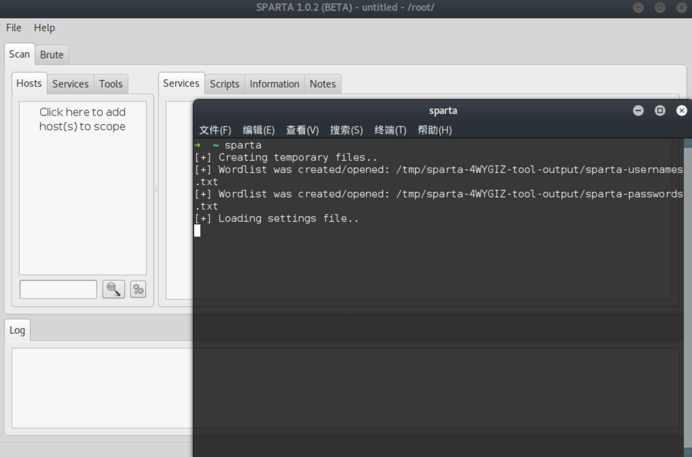
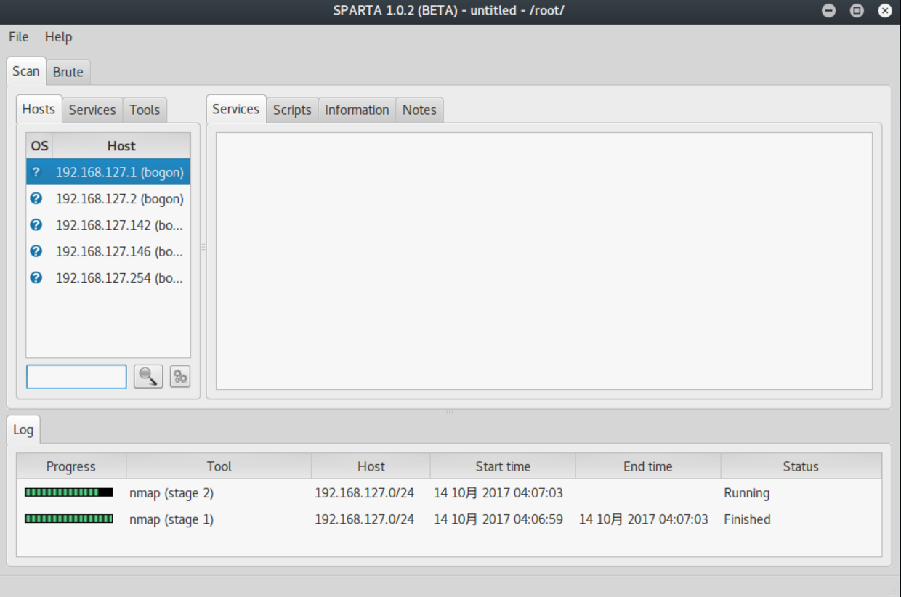
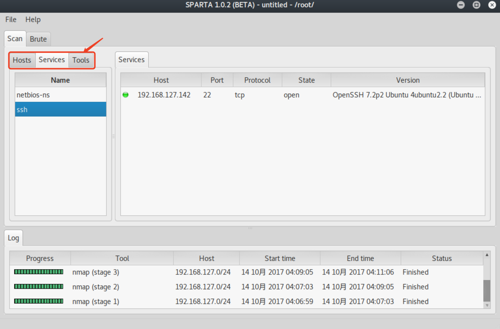
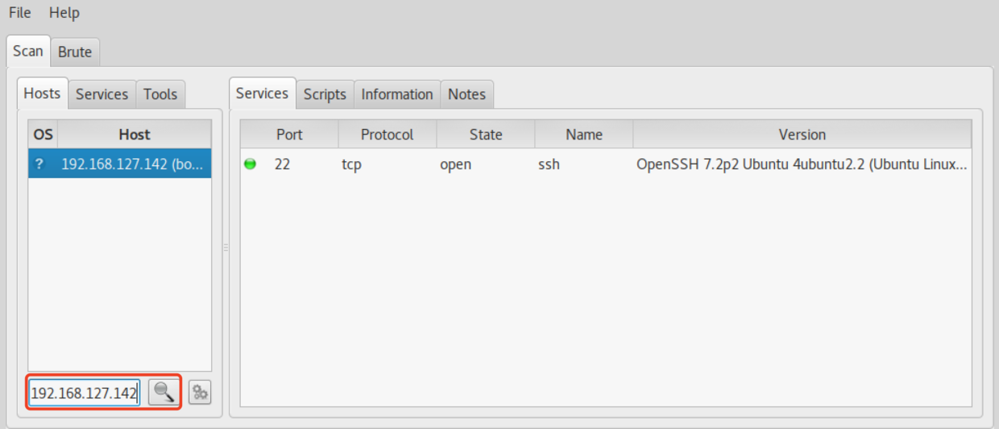
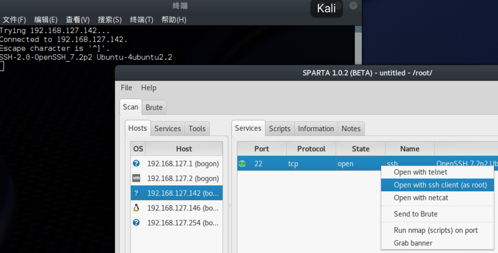
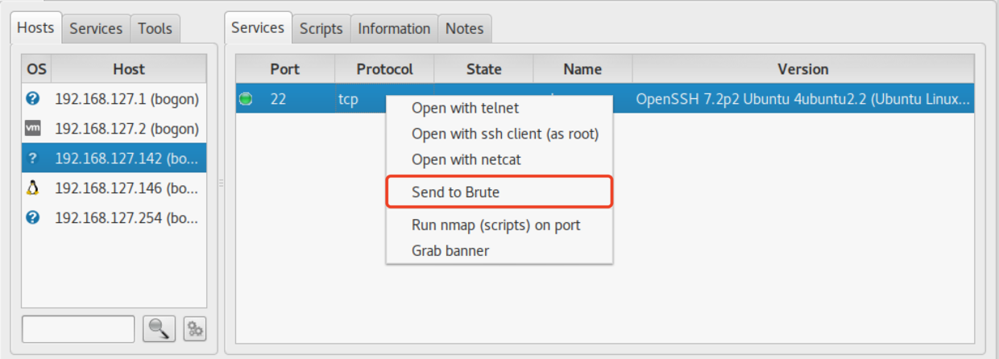
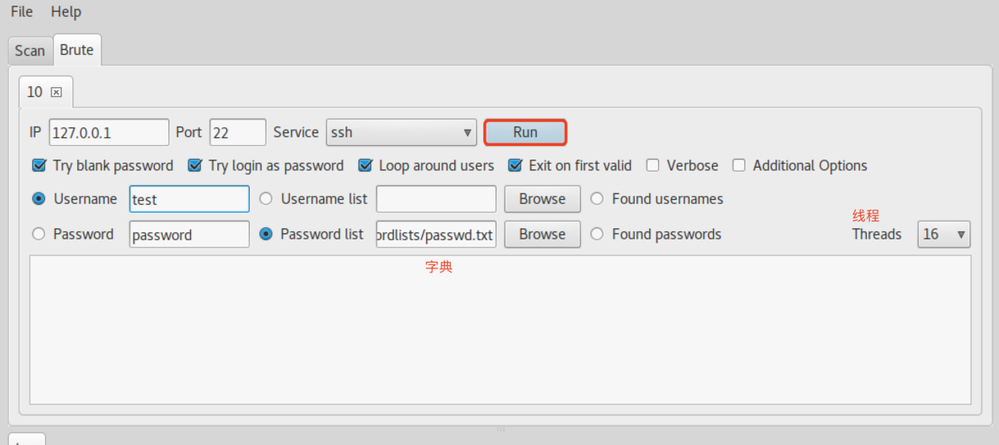
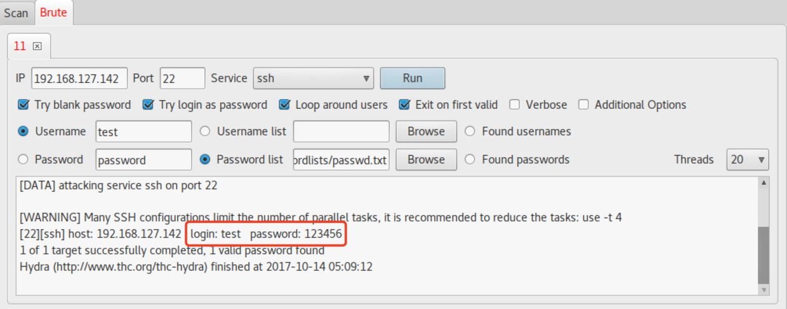

# Kali工具库之Sparta（斯巴达）--信息收集扫描爆破集成 

## 0x00 工具简介

学习渗透测试可能都知道Nmap，Metasploite，Sqlmap、Hydra等神器，这些神器不管是单一功能还是额外脚本插件都很强大。但有时候我们也需要多款工具组合使用，这时候集成工具的便捷性就体现出来了。

今天介绍的工具是[Sparta（斯巴达）](http://sparta.secforce.com)，一款kali linux的系统本身集成的Python GUI应用程序工具。`Sparta`是一个Nmap、Nikto、Hydra等工具的集合，利用各个工具的优秀功能，完成信息收集、扫描和爆破等一体化的工具流。

## 0x01 功能介绍

`Sparta`主要包含以下功能：

1.  端口扫描，程序自动调用nmap进行扫描，根据nmap的扫描结果，nikto自动加载结果，展开更精确的扫描。
2.  针对扫描的结果，特定使用，如：使用dirbuster目录爆破，利用webslayer进行web指纹识别。
3.  针对可爆力破解的端口，可调用hydra进行暴力破解。

## 0x02 安装使用

### Kali Linux用户(推荐使用)

*   Kali本身集成了该工具，使用命令行`sparta`即可打开。

### 非Kali Linux用户

*   从github上克隆最新版SPARTA源码：

    `git clone https://github.com/secforce/sparta.git`
*   点击[这里](https://github.com/SECFORCE/sparta/archive/master.zip)下载最新zip压缩包。
*   安装Requirements

    *   Ubuntu 14.04+
        `apt-get install python-elixir python-qt4 xsltproc`
*   安装SPARTA依赖的基本工具

    *   nmap (扫描)
    *   hydra (爆破)
    *   cutycapt (截图)
        `apt-get install nmap hydra cutycapt`
*   安装SPARTA默认配置

    `apt-get install ldap-utils rwho rsh-client x11-apps finger`

### 0x03 使用说明

*   工具截图

*   扫描

    点击左侧hosts栏空白处，在弹出的窗口中添加扫描的主机段，本次扫描内网段为`192.168.127.0/24`，点击Add to Scope开始扫描。（可勾选使用nmap的主机发现和分段扫描功能）

扫描开始，通过扫描状态（Finished/Running）判断扫描是否完毕，通过下面的扫描状态栏，我们可以看到扫描用到了nmap和nikto工具进行自动化扫描

扫描完毕后，切换左侧Hosts、Services、Tools栏可查看主机、系统信息，服务信息以及工具扫描结果的列表。

在HOSTS栏选择其中一个主机，可在右侧显示更多信息：服务端口开放情况、利用脚本、基本网路信息等。

当扫描结果过多时，可使用搜索功能进行筛选。

或者点击搜索旁边的小图标，使用过滤器进一步筛选

*   爆破

本次选择常用的SSH服务进行举例，右键点击目标端口，可以看见Telnet、ssh客户端、Netcat等连接功能。选择后即可自动打开terminal尝试连接。

我们选择`Send to Burte`,讲目标端口发送至Burte功能。

点击左上角Brute按钮，进入Burte功能主页

设置好帐号、密码、线程树后，点击`Run`开始爆破（账号密码可自行指定或者加载字典文件）

如下图，成功爆出测试账号（test）密码（123456）

爆破其他服务、端口方法类似，可自行尝试。